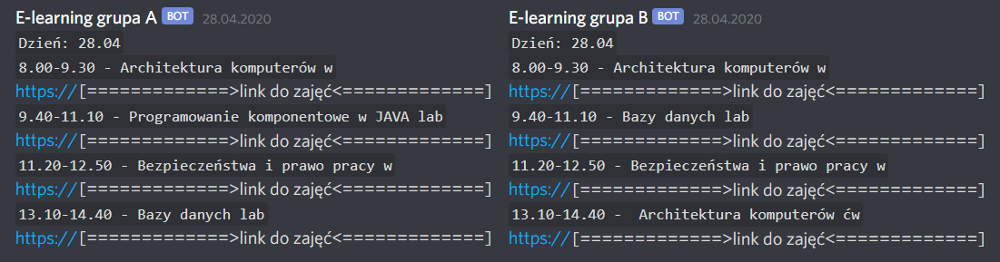

# E-Learning WSIZ
Aplikacja wysyłająca do podanych webhooków *Discorda* dzisiejszy **plan zajęć (z linkami)**, dla obydwu grup podanego semestru, na podstawie pliku otrzymanego od uczelni.

## Zewnętrzne biblioteki
* [POI](https://poi.apache.org/download.html)
* [HttpClient](https://hc.apache.org/downloads.cgi)
* [HttpCore](https://hc.apache.org/downloads.cgi)
* [Commons Logging](https://commons.apache.org/proper/commons-logging/download_logging.cgi)
* [GSON](https://github.com/google/gson)

## Setup
Do prawidłowego działała aplikacji należy w pliku `Data.json` podmienić wartości podanych zmiennych:
* `webhook_for_A` - webhookiem do kanału, gdzie będzie wysyłany plan dla grupy A
* `webhook_for_B` - webhookiem do kanału, gdzie będzie wysyłany plan dla grupy B
* `semester` - `*S`, gdzie `*` przedstawia numer semestru np. `4S`

## Działanie
Aplikacja po uruchomieniu sprawdza, czy w jej lokacji znajdują się pliki `.xls` oraz `.json`. Następnie z pliku `.xls` wyodrębnia dzisiejszy plan zajęć dla **grupy A** oraz plan zajęć dla **grupy B**. Po ukończeniu operacji wysyła poszczególne plany zajęć do podanych webhooków *Discordowych* znajdujących się w pliku `.json`.

Zaleca się uruchamianie aplikacji każdego dnia przy pomocy programu **Cron**, znajdującego się w systemach operacyjnych z rodziny Unixa.
